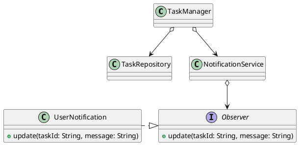

### Activity.puml
Показывает поток действий пользователя в системе.
___
### Class Diagram.puml
Описывает структуру классов системы с применением паттернов Singleton и Observer.

___
### Component Diagram.puml
Показывает архитектуру системы и связи между компонентами.
___
### Sequence Diagram.puml
Иллюстрирует взаимодействие между объектами при выполнении операций.
___
### Use Case.puml
Описывает действия пользователя в системе планирования задач.
___
В UML-диаграммах, созданных с помощью PlantUML, стрелки используются для обозначения различных типов отношений между элементами. Давайте разберёмся, что означают конкретные стрелки `o-->` и `.|>`, которые вы упомянули, и объясним их в контексте предоставленного дизайна системы планирования задач. Я также учту ваш запрос о понятном объяснении и рассмотрении возможных вариантов интерпретации.

### 1. Стрелка `o-->`
- **Значение**: В PlantUML стрелка `o-->` обозначает **ассоциацию** с агрегацией (aggregation). Это тип отношения, при котором один объект (целое) содержит или управляет другими объектами (частями), но части могут существовать независимо от целого.
- **Контекст в диаграммах**:
  - В **Class Diagram** из предыдущего ответа:
    - `TaskManager o--> TaskRepository`: Это указывает, что `TaskManager` имеет агрегацию с `TaskRepository`. `TaskManager` использует экземпляр `TaskRepository` для хранения и управления задачами, но `TaskRepository` (как Singleton) может существовать независимо от `TaskManager`.
    - `TaskManager o--> NotificationService`: Аналогично, `TaskManager` использует `NotificationService` для отправки уведомлений, но `NotificationService` может существовать отдельно.
    - `NotificationService o--> Observer`: `NotificationService` содержит список объектов, реализующих интерфейс `Observer`, для уведомлений, но наблюдатели (например, `UserNotification`) могут существовать независимо.
  - В **Component Diagram**:
    - Например, `[TaskManager] --> [TaskRepository]`: Здесь стрелка без `o` обозначает простую ассоциацию, но если бы использовалась `o-->`, это указывало бы на агрегацию, где `TaskManager` управляет `TaskRepository` как частью своей функциональности.
- **Интерпретация**:
  - Агрегация (`o-->`) подразумевает "слабую" связь, где часть (например, `TaskRepository`) не уничтожается, если целое (`TaskManager`) перестаёт существовать. Это подходит для нашего дизайна, так как `TaskRepository` (Singleton) должен быть доступен глобально и не зависит от жизненного цикла `TaskManager`.
- **Варианты исхода**:
  - Если вместо агрегации нужна более сильная связь, можно использовать **композицию** (`*-->`), где части уничтожаются вместе с целым. Например, если бы `TaskRepository` создавался и уничтожался вместе с `TaskManager`, мы бы использовали `*-->`.
  - Если связь вообще не подразумевает владение, а только использование, можно использовать простую ассоциацию (`-->`) без `o`.

### 2. Стрелка `.|>`
- **Значение**: В PlantUML стрелка `.|>` обозначает **реализацию интерфейса** (implementation). Это отношение между классом и интерфейсом, которое показывает, что класс реализует методы, объявленные в интерфейсе.
- **Контекст в диаграммах**:
  - В **Class Diagram**:
    - `UserNotification .|> Observer`: Это указывает, что класс `UserNotification` реализует интерфейс `Observer`. То есть `UserNotification` обязан предоставить реализацию метода `update(taskId: String, message: String)`, объявленного в интерфейсе `Observer`.
  - Это соответствует паттерну **Observer**, где `NotificationService` отправляет уведомления всем объектам, реализующим интерфейс `Observer` (в данном случае `UserNotification`).
- **Интерпретация**:
  - Реализация интерфейса (`UserNotification .|> Observer`) позволяет системе быть гибкой: любой класс, реализующий `Observer`, может быть добавлен в список наблюдателей `NotificationService`. Это обеспечивает расширяемость системы (например, можно добавить уведомления по email или SMS, создав новые классы, реализующие `Observer`).
- **Варианты исхода**:
  - Если вместо интерфейса используется абстрактный класс, отношение реализации всё равно обозначается `.|>`, но это менее гибко, так как классы не могут наследовать несколько абстрактных классов.
  - Если связь между `UserNotification` и `Observer` отсутствует, то `UserNotification` не сможет быть наблюдателем, и паттерн Observer не будет работать. В таком случае нужно пересмотреть архитектуру уведомлений.

### Пример из Class Diagram (для наглядности)

- Здесь `o-->` показывает, что `TaskManager` агрегирует `TaskRepository` и `NotificationService`, а `NotificationService` агрегирует наблюдателей (`Observer`).
- `.|>` показывает, что `UserNotification` реализует интерфейс `Observer`.

### Возможные варианты интерпретации и исходов
1. **Ошибочная интерпретация стрелок**:
   - Если вы видите `o-->` и думаете, что это композиция (`*-->`) вместо агрегации, это может привести к неправильному пониманию жизненного цикла объектов. Например, вы можете предположить, что `TaskRepository` уничтожается вместе с `TaskManager`, что неверно в данном дизайне.
   - Если `.|>` путается с наследованием (`<|-->`), это может создать путаницу, так как наследование (extends) и реализация интерфейса (implements) — разные концепции.

2. **Изменение дизайна**:
   - Если вы хотите, чтобы `TaskRepository` был более тесно связан с `TaskManager`, можно заменить `o-->` на `*-->`, что сделает `TaskRepository` частью `TaskManager` с общим жизненным циклом.
   - Если нужно добавить несколько типов уведомлений, можно создать дополнительные классы, реализующие `Observer` (например, `EmailNotification .|> Observer`), сохранив `.|>`.
   - Если Singleton в `TaskRepository` не нужен, можно убрать паттерн Singleton и использовать простую ассоциацию (`-->`) вместо `o-->`, чтобы указать, что `TaskManager` просто использует экземпляр `TaskRepository`.

3. **Альтернативные нотации**:
   - В некоторых UML-инструментах вместо `o-->` для агрегации используется ромб (◇) на стороне целого, а вместо `.|>` для реализации — пунктирная стрелка с треугольником. PlantUML упрощает это для текстового формата, но смысл остаётся тем же.

### Почему это важно?
- **Для понимания системы**: Стрелки `o-->` и `.|>` в диаграммах точно описывают отношения между компонентами, что помогает разработчикам понять, как объекты взаимодействуют и как организована архитектура.
- **Для реализации кода**: Например, `o-->` в `TaskManager o--> TaskRepository` означает, что в коде `TaskManager` будет иметь поле `TaskRepository`, а `.|>` в `UserNotification .|> Observer` означает, что `UserNotification` должен реализовать методы интерфейса `Observer`.

### Ответ на ваш вопрос
- `o-->`: Обозначает агрегацию, где один объект (например, `TaskManager`) содержит или использует другой (например, `TaskRepository`), но второй может существовать независимо.
- `.|>`: Обозначает реализацию интерфейса, где класс (например, `UserNotification`) предоставляет конкретную реализацию методов интерфейса (например, `Observer`).
